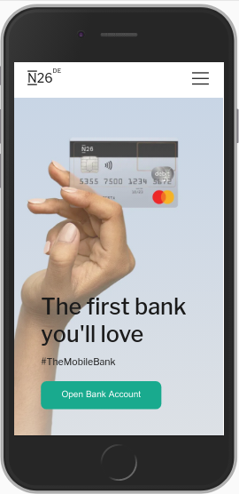

# <a href="https://jseguraweb.github.io/n26-web-clone/">Clone of N26 Site</a>

> CSS Project: create a clone of the N26 website

> ## Details:

- It's about practicing. The intended user and the client is going to be me. 
- Goal: include it in my portfolio.
- Content required: 
    
    - Font awesome icons

    - Backgrounds and images

> ## Priorities:

1. Start a Repository on GitHub
2. Follow the original website wireframe
3. Research. Topic: how to deal with font awesome icons and responsive navbar
4. Coding time

    **GOAL: create a responsive clone of the N26 website**

    

> ## New skills (to research):

- font awesome icons

- responsive navigation's bar

> ## Achievements + lessons learned:

- get comfortable positioning elements and keep learning responsive design
